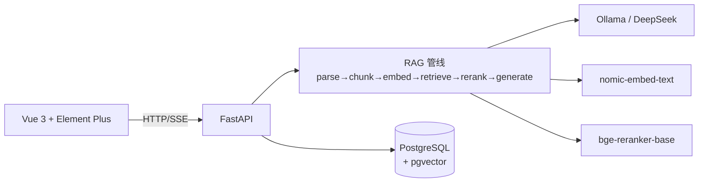

# InsightRAG

**企业级多知识库智能检索与问答平台**

面向企业内部知识管理场景，支持多知识库、PDF/DOCX/Markdown/TXT 文档解析、结构化切片、Dense Retrieval、BM25、Hybrid Search、RRF、Reranker、Parent-Child Retrieval、Citation 溯源、SSE 流式问答、Retrieval Lab、Golden Dataset 与检索评测。

> 本项目为 Demo/实习级验证规模，不宣称百万级生产检索。所有评测数字均来自真实运行，未伪造。

---

## 核心能力

- **多知识库管理**：创建、编辑、删除知识库，权限隔离
- **文档解析与版本**：PDF/DOCX/Markdown/TXT，逻辑文档 + 多版本（CURRENT/HISTORICAL）
- **混合检索**：Dense（pgvector）+ BM25（jieba）→ RRF → Reranker（bge-reranker）
- **Parent-Child 切片**：小块检索、大块生成，命中 CHILD 回溯 PARENT 上下文
- **引用溯源**：回答绑定文档版本 + 章节路径 + 页码 + 原文高亮
- **SSE 流式问答**：逐字输出 + Evidence 三态（SUFFICIENT/INSUFFICIENT/CONFLICTING）
- **Retrieval Lab**：单策略/对比/评测，展示 Query Plan、阶段耗时、排名变化
- **Embedding 切换闭环**：影响检查 + 后台重建 + 失败自动回退旧索引

## 系统架构



详见 [docs/architecture.md](./docs/architecture.md)。

## UI Screenshots

UI 依据随需求提供的 8 张 InsightRAG V2 设计图实现，参考图见 `docs/ui-reference/`。

## Document Pipeline

```text
上传 → 保存原始文件 → PARSING → CHUNKING(Parent/Child) → INDEXING(嵌入 CHILD) → 重建 BM25 → READY
```

状态机：`UPLOADED → PARSING → CHUNKING → INDEXING → READY`（异常 `FAILED` / `NEEDS_REINDEX`）。详见 [docs/document-pipeline.md](./docs/document-pipeline.md)。

## RAG Pipeline

```text
Question → KB 范围校验 → CURRENT+READY 过滤 → Dense Top10 + BM25 Top10
→ RRF → Candidate Top12 → Reranker → Top6 → Parent Recovery → Final ≈4
→ Evidence Check → LLM 生成 → Citation → SSE
```

详见 [docs/rag-pipeline.md](./docs/rag-pipeline.md)。

## 技术栈

| 层 | 技术 |
|----|------|
| Frontend | Vue 3, Vite, TypeScript, Element Plus, Pinia, Vue Router, Axios |
| Backend | Python 3.12+, FastAPI, Pydantic v2, SQLAlchemy 2.x, JWT, Passlib, Pytest |
| Data | PostgreSQL 16+, pgvector |
| RAG | rank_bm25, jieba, sentence-transformers (CrossEncoder), PyMuPDF, python-docx |
| LLM | Ollama（本地）/ DeepSeek（云端，可选） |

## 项目目录

```text
InsightRAG/
├─ backend/            # FastAPI 后端
│  ├─ app/
│  │  ├─ api/          # 路由层
│  │  ├─ services/     # 业务编排层
│  │  ├─ rag/          # RAG 管线（parsing/chunking/embedding/retrieval/reranking/generation/evaluation）
│  │  ├─ providers/    # LLM/Embedding/Reranker 适配
│  │  ├─ models/       # ORM 模型
│  │  └─ main.py
│  └─ tests/
├─ frontend/           # Vue 3 前端
├─ demo-data/          # 演示数据 + Golden Dataset + seed manifest
├─ docs/               # 架构/RAG/文档管线/评测文档 + UI 参考图
├─ scripts/            # seed / evaluation / 启动 / 发布脚本
├─ docker-compose.yml  # PostgreSQL + pgvector
└─ .env.example
```

## Quick Start

### 前置条件

- Python 3.12+
- Node.js 20+
- Docker（PostgreSQL + pgvector）
- Ollama（可选，用于 Embedding 与 LLM）

### 1. 启动数据库

```bash
docker-compose up -d
```

### 2. 后端

```bash
cd backend
python -m venv .venv && source .venv/bin/activate   # Windows: .venv\Scripts\activate
pip install -r requirements.txt
cp ../.env.example ../.env                          # 按需修改
python -m uvicorn app.main:app --host 127.0.0.1 --port 8000 --reload
```

### 3. 前端

```bash
cd frontend
npm install
npm run dev                                         # http://localhost:5173
```

### 4. 初始化演示数据

```bash
python scripts/seed_demo_data.py                    # 6 个知识库 + 24 份文档
```

默认演示账号：`demo@nexatech.demo` / `NexaTech2026`

### 5. 一键启动（Windows）

```powershell
.\scripts\start_dev.ps1
```

## 环境变量

见 [.env.example](./.env.example)，关键项：

| 变量 | 说明 |
|------|------|
| `DATABASE_URL` | PostgreSQL 连接串 |
| `JWT_SECRET` | JWT 签名密钥（**务必修改**） |
| `OLLAMA_BASE_URL` | Ollama 地址，默认 `http://localhost:11434` |
| `OLLAMA_LLM_MODEL` | LLM 模型，默认 `qwen2.5:7b` |
| `OLLAMA_EMBEDDING_MODEL` | Embedding 模型，默认 `nomic-embed-text` |
| `DEEPSEEK_BASE_URL` | DeepSeek API 地址，默认 `https://api.deepseek.com` |
| `DEEPSEEK_API_KEY` | DeepSeek API Key（留空则未配置） |
| `DEEPSEEK_LLM_MODEL` | DeepSeek 模型，默认 `deepseek-chat` |
| `OPENAI_COMPATIBLE_*` | 通用 OpenAI 兼容接口（可选，留空则未配置） |
| `RERANKER_MODEL` | Reranker 模型，默认 `BAAI/bge-reranker-base` |

## Ollama 配置

```bash
ollama pull qwen2.5:7b
ollama pull nomic-embed-text
```

后端启动时自动检测 `/api/tags` 并优先使用 `qwen2.5:7b`。若 `nomic-embed-text` 未安装，会尝试自动拉取；网络失败时设置页显示"Embedding 模型未就绪"，不影响其它功能。

## DeepSeek 配置

在 `.env` 填写 `DEEPSEEK_API_KEY`（前往 [platform.deepseek.com](https://platform.deepseek.com) 获取）即可启用 DeepSeek 云端模型，默认模型为 `deepseek-chat`（可切换 `deepseek-reasoner`）。Key 为空时 UI 显示"未配置"，应用不崩溃，仍可用本地 Ollama。

## Demo Data

虚构企业 **NexaTech**，6 个知识库、24 份逻辑文档：

| 知识库 | 文档数 |
|--------|--------|
| 人事制度库 | 4 |
| 财务制度库 | 5（含差旅管理制度 V2.0/V3.0 两版本） |
| 产品知识库 | 4 |
| 客服知识库 | 3 |
| 采购管理库 | 4 |
| 信息安全库 | 4 |

## Retrieval Lab

三个 Tab：

- **Single**：单策略检索，展示 Query Plan、阶段耗时、排名变化（`RRF #4 → Final #1 ↑+3`）、hit keywords、Parent Context、Metadata
- **Compare**：左右对比两种策略 Top K
- **Evaluation**：运行 Golden Dataset，展示 Recall@5 / MRR / Latency

## Evaluation

评测集约 41 条 demo ground truth（`demo-data/golden-dataset.json`）。

```bash
python scripts/run_evaluation.py
```

结果写入 `docs/evaluation.md`。当前实测（demo 环境）：

| 策略 | Recall@5 | MRR | Avg Latency |
|------|----------|-----|-------------|
| Dense | 0.805 | 0.480 | 2136 ms |
| Hybrid | 1.000 | 0.760 | 2132 ms |
| Hybrid + Reranker | 1.000 | 0.963 | 2807 ms |

## 设计取舍

- **模块化单体**：不拆微服务，业务代码与 RAG 代码分层
- **Parent-Child**：小块检索大块生成，平衡检索精度与上下文完整性
- **RRF 而非加权融合**：免去 alpha 调参，UI 不暴露权重参数
- **exact cosine**：万级 Chunk 内用精确检索，避免维度切换的索引复杂度
- **Embedding 双 profile**：切换安全，失败自动回退旧索引

## 已知限制

- Demo/实习级规模：单用户 ≤10 KB、单 KB ≤100 文档、Chunk 万级、单文件 ≤30MB
- **PDF 扫描件不支持 OCR**
- 未实现 SSO/MFA/邮件找回密码（见 Future Work）
- RRF constant、Reranker top_k 等为默认工程参数，非全局最优
- Dense 检索未启用 HNSW/IVFFlat 近似索引

## Future Work

- SSO / MFA / 邮件找回密码
- PDF 扫描件 OCR
- HNSW/IVFFlat 近似检索（更大规模）
- Faithfulness 评测
- 更细粒度权限（RBAC）

## License

MIT
