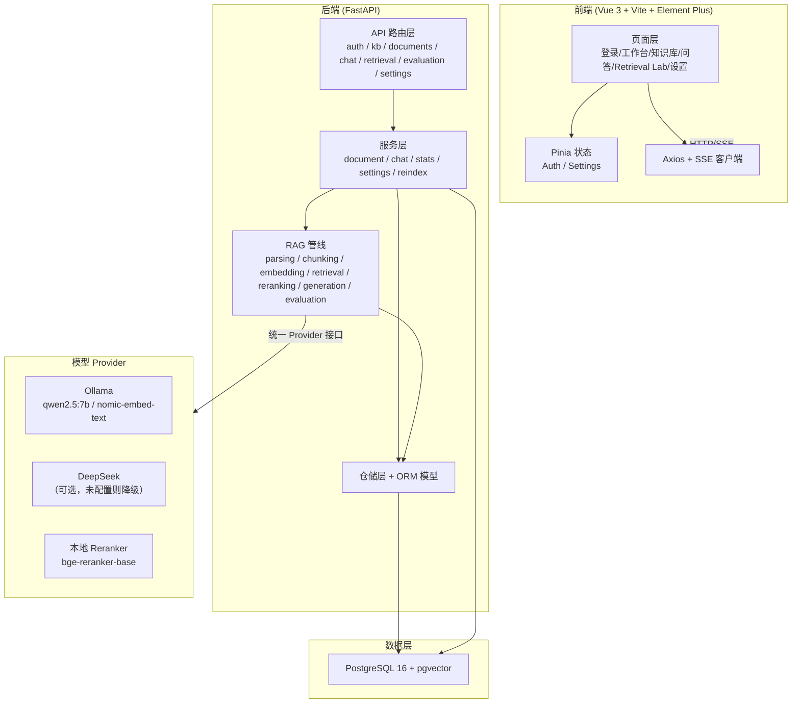
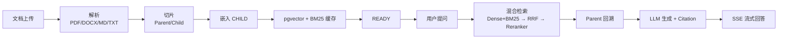

# InsightRAG 系统架构

> 企业级多知识库智能检索与问答平台（Demo/实习级验证规模）

## 总体架构

InsightRAG 采用**模块化单体**架构，前端 Vue 3 SPA + 后端 FastAPI + PostgreSQL(pgvector) 数据层，LLM/Embedding/Reranker 通过统一 Provider 接口接入（本地 Ollama 或 DeepSeek 云端）。

## 分层职责

| 层 | 目录 | 职责 |
|----|------|------|
| API 路由 | `backend/app/api/` | HTTP/SSE 端点、参数校验、鉴权依赖 |
| 服务层 | `backend/app/services/` | 业务编排：文档状态机、对话、统计、设置、重建索引 |
| RAG 管线 | `backend/app/rag/` | 解析、切片、嵌入、检索、重排、生成、评测（纯算法，不含业务） |
| Provider | `backend/app/providers/` | LLM / Embedding / Reranker 的统一适配，可热切换 |
| 模型层 | `backend/app/models/` | SQLAlchemy ORM，含 documents/document_versions/chunks 等 |
| 仓储层 | `backend/app/repositories/` | 数据访问封装 |

## 关键设计决策

1. **逻辑文档与版本分离**：`documents`（逻辑文档）与 `document_versions`（版本）分开，同一制度可有多版本，默认仅检索 CURRENT+READY 版本。
2. **Parent-Child 切片**：CHILD（约 400 tokens）用于检索，PARENT（约 1000 tokens）用于生成上下文，命中 CHILD 后回溯 PARENT。
3. **Embedding profile 双版本**：切换 Embedding 时新建 BUILDING profile 后台重建，旧 ACTIVE profile 继续服务，全部成功后原子切换，失败自动回退。
4. **真实统计口径**：所有页面统计由统一 `stats_service` 计算，前端不硬编码数字。

## 数据流

## 规模边界（明确声明）

本项目是 Demo/实习级验证规模，不宣称百万级生产检索：

- 单用户 ≤ 10 个知识库
- 单知识库 ≤ 100 文档
- Chunk 万级以内
- 单文件 ≤ 30MB
- Dense 检索使用 exact cosine similarity（未启用 HNSW/IVFFlat）
