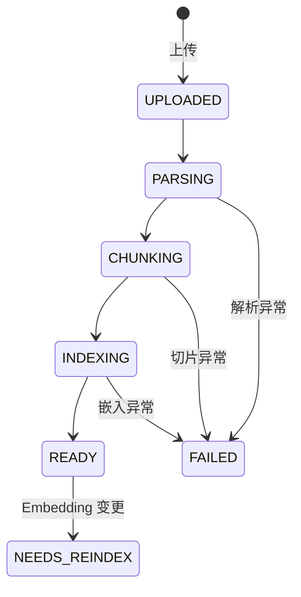
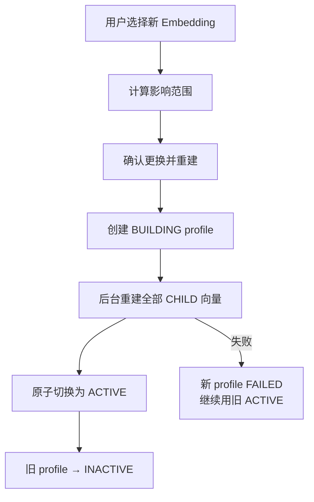

# 文档处理管线

> 文档上传 → 解析 → 切片 → 索引 → READY 的完整链路

## 状态机



状态转换真实发生，**上传不会直接伪造 READY**。

## 管线步骤


### 1. 原始文件存储

```
data/uploads/{user_id}/{knowledge_base_id}/{document_id}/{version_id}/source.ext
```

本地文件存储，不加 OSS/MinIO。

### 2. Parser

统一 `DocumentParser` 接口，输出 `NormalizedDocument`（含 Section 列表），后续切片不关心源格式：

| Parser | 格式 | 说明 |
|--------|------|------|
| PdfParser | PDF | PyMuPDF，保留 page_number，识别标题/块；无有效文本时提示扫描件不支持 OCR |
| DocxParser | DOCX | 读 Heading 1/2/3 + 段落，表格转 Markdown table |
| MarkdownParser | MD | 解析 `# / ## / ###`，strip front matter |
| TextParser | TXT | 无结构时按段落 + token window 降级 |

### 3. Chunking（结构感知 + Parent-Child）

原则：**小块检索，大块生成**。

| 类型 | 大小 | 用途 |
|------|------|------|
| CHILD | 约 300~500 tokens（默认 400） | Dense / BM25 检索 |
| PARENT | 约 800~1500 tokens（默认 1000） | 生成上下文，默认不嵌入 |

- Child overlap ≈ 50 tokens（可配置）
- 有标题结构时按 Section/Heading 优先切分
- 每个 CHILD 保留 `heading_path`、`page_number`、`chunk_index`、`parent_id`

### 4. Embedding 与 Reindex 闭环

Embedding 与 LLM 的切换逻辑不同：LLM 可热切换，Embedding 更换后旧向量不能继续使用。



- 提供影响范围查看、重建进度、失败原因、Retry
- 失败自动继续使用旧索引（首版回滚策略），不实现复杂手动回滚按钮
- 文档处理使用 FastAPI BackgroundTasks / 应用内异步任务，不加 Celery/RabbitMQ

## 支持格式与限制

- 支持：PDF（文本型）、DOCX、Markdown、TXT
- **扫描 PDF**：检测到无有效文本时明确提示"当前文件可能为扫描件，暂不支持 OCR"，不生成空索引
- 单文件 ≤ 30MB
