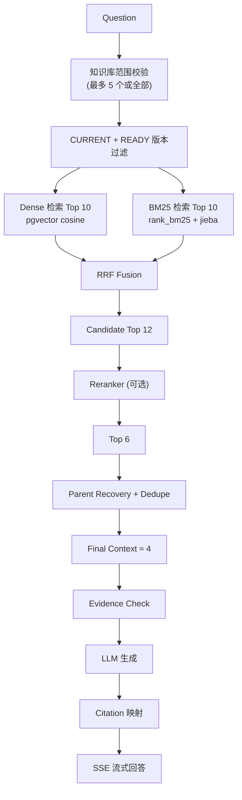

# RAG 检索管线

> InsightRAG 的混合检索与生成管线说明

## 管线总览



## 各阶段说明

### 1. Dense Retrieval（向量检索）

- Query 经 Embedding 模型编码为向量
- 与 CHILD chunk 的向量做 cosine similarity（pgvector `<->` 算子）
- Demo 规模使用 exact search

### 2. BM25（关键词检索）

- `rank_bm25`（BM25Plus 变体）+ jieba 中文分词
- 按知识库范围建立内存索引缓存，上传/删除/重建后 invalidate
- 同义词表扩展提升召回（如"出差"↔"差旅"、"年假"↔"年休假"）

### 3. RRF（Reciprocal Rank Fusion）

融合 Dense 与 BM25 排名，公式：

```
RRF_score(d) = Σ 1 / (k + rank_i(d))
```

- 默认 `k = 60`（工程默认值，Retrieval Lab 可调）
- **本项目使用 RRF，UI 不提供 alpha 权重参数**

### 4. Reranker（可选）

- 本地 CrossEncoder（`bge-reranker-base`）
- 对 RRF 候选做语义精排，记录 `RRF rank → Final rank` 与 rank delta

### 5. Parent Recovery

- 命中 CHILD chunk 后，通过 `parent_id` 回溯 PARENT chunk
- 对多个 CHILD 共享的 PARENT 去重，拼接为最终生成上下文

### 6. Evidence Check

三态（不使用无法校准的"高可信 96%"）：

| 状态 | 含义 |
|------|------|
| SUFFICIENT | 已检索到相关资料 |
| INSUFFICIENT | 相关资料不足（无召回或 top 结果低于阈值） |
| CONFLICTING | 多份当前有效资料在核心事实/数字/时间上冲突 |

无证据时 LLM 不得自由补答，应明确"当前知识库中未找到足够信息"。

### 7. Citation 映射

Answer 中的 `[1][2]` 绑定到具体 `document_version`，记录 quote_text、章节路径、页码、生效日期。

## 默认参数（非最优值声明）

| 参数 | 默认值 |
|------|--------|
| Dense top_k | 10 |
| BM25 top_k | 10 |
| RRF candidate_k | 12 |
| RRF constant | 60 |
| Reranker top_k | 6 |
| Final context | 4 |

以上均为工程默认参数，可在 Retrieval Lab 高级参数中调整，**不宣称全局最优**。

## 评测结果

见 [evaluation.md](./evaluation.md)，全部来自真实检索运行。
